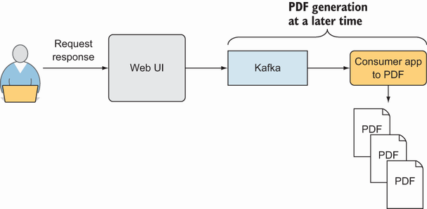
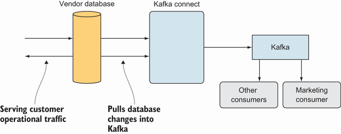
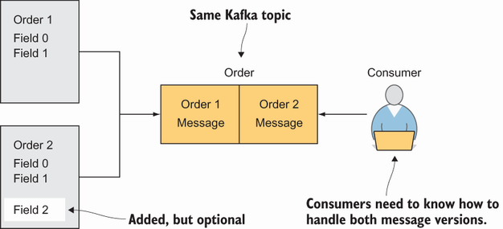
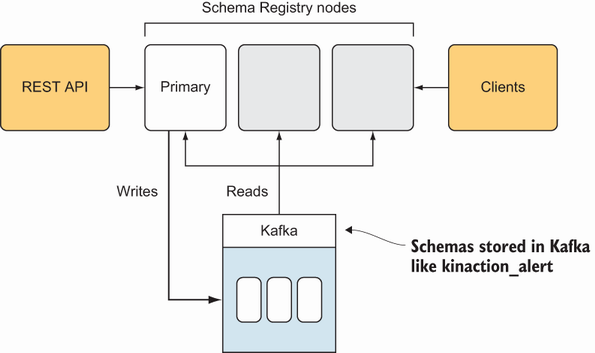
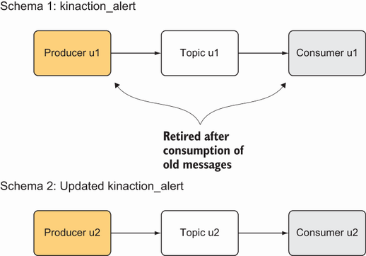

# 11 Schema registry
This chapters covers

* Developing a proposed Kafka maturity model
* The value schemas can provide for your data as it changes
* Reviewing Avro and data serialization
* Compatibility rules for schema changes over time

As you have discovered the various ways to use Apache Kafka, it might be an interesting experiment to think about how you view Kafka the more you utilize it. 

As enterprises (or even tools) grow, they can sometimes be modeled with maturity levels. Martin Fowler provides a great explanation for this at https://martinfowler.com/bliki/MaturityModel.html [1]. Fowler also has a good example that explains the Richardson Maturity Model, which looks at REST [2]. For even further reference, the original talk, “Justice Will Take Us Millions Of Intricate Moves: Act Three: The Maturity Heuristic” by Leonard Richardson can be found at https://www.crummy.com/writing/speaking/2008-QCon/act3.html . The act3.html website text is licensed under the Creative Commons License at https://creativecommons.org/licenses/by-sa/2.0/legalcode.

## 11.1 A proposed Kafka maturity model
In the following sections, we focus our discussion on maturity levels specific to Kafka. For a comparison, check out the Confluent white paper titled, “[Five Stages to Streaming Platform Adoption](https://assets.confluent.io/m/41f3c9186d4adb03/original/20180927-WP-Five-Stages_to_Streaming_Platform_Adoption.pdf?ajs_aid=4224d8d2-95b7-4b07-92d7-0dba251be61e&_ga=2.84813978.2024891929.1650607704-1763164608.1648258250)” , which presents a different perspective that encompasses five stages of their streaming maturity model with distinct criteria for each stage [3]. Let’s look at our first level (of course, as programmers we start with level 0).

We use this exercise with a maturity model so that we can think about how Kafka can be a powerful tool for one application or even evolve into the foundation for all of your enterprise’s applications rather than as a simple message broker. The following levels aren’t meant to be a step-by-step required path, but rather a way to think about how you might start and then progress with Kafka. These steps are debatable, of course, but we simply offer an example path.

### 11.1.1 Level 0
At this level, we use Kafka as an enterprise service bus (ESB) or publish/subscribe (pub/sub) system. Events provide asynchronous communication between applications, whether we are replacing a different message broker like RabbitMQ or just starting with this pattern.

One example use case is a user submitting a text document to be converted into a PDF. Once a user submits a document, the application stores the document and then sends a message to a Kafka topic. A Kafka consumer then reads the message to determine which documents need to be converted into a PDF. In this example, the drive might be offloaded to work with a backend system that a user knows will not send a response right away. Figure 11.1 shows this message bus in action.


  
Figure 11.1 Level 0 example

This level alone brings us the benefit of allowing us to decouple a system so that a failure of our frontend text submission system does not impact our backend system. Also, we don’t need to rely on both to maintain successful simultaneous operations.

### 11.1.2 Level 1
Batch processing can still be present in areas of our enterprise, but most data produced is now brought into Kafka. Whether with extract, transform, load (ETL) or change data capture (CDC) processes, Kafka starts to gather events from more and more systems in our enterprise. Level 1 allows us to have an operational, real-time data flow and gives us the ability to feed data quickly into analytical systems.

An example of this might be a vendor database that holds customer information. We do not want our marketing folks to run complex queries that could slow down our production traffic. In this case, we can use Kafka Connect to write the data from database tables into Kafka topics that we can use on our terms. Figure 11.2 shows Kafka Connect capturing data from a relational database and moving that data into a Kafka topic.


  
Figure 11.2 Level 1 example

### 11.1.3 Level 2
We realize that data will change over time and that schemas are needed. Although our producers and consumers might be decoupled, they still need a way to understand the data itself. For this, we’ll take advantage of schemas and a schema registry. And even though it would have been ideal to start with schemas, the reality is that this need often presents itself a couple of application changes later, after initial deployments.

One example for this level is changing the data structure of an event to receive orders from our processing system. New data is added, but the new fields are optional, and this works fine because our schema registry is configured to support backward compatibility. Figure 11.3 shows our consumer’s need for schemas. We will look more into these details as we progress through this chapter.


 
Figure 11.3 Level 2 example

### 11.1.4 Level 3
Everything is an event stream that is infinite (never ending). Kafka is the system of our enterprise for our event-based applications. In other words, we don’t have customers waiting for recommendations or status reports that used to be produced by an overnight batch-processing run. Customers are alerted in milliseconds of a change to their account when an event happens, not in minutes. Instead of pulling data from other data sources, applications pull data directly from your cluster. User-facing applications can derive state and materialized views to customers depending on the needs of our core Kafka infrastructure.

11.2 The Schema Registry
As part of our work in this chapter, we will focus on level 2, looking at how we can plan for data to change over time. Now that we have become good at sending data into and out of Kafka, and despite a small mention of schemas in chapter 3, we left out some important details. Let’s dive into what the Confluent Schema Registry provides for us.

The Confluent Schema Registry stores our named schemas and allows us to maintain multiple versions [4]. This is somewhat similar to the Docker Registry in purpose, which stores and distributes Docker images. Why is this storage needed? Producers and consumers are not tied together, but they still need a way to discover the schema involved in the data from all clients. Also, by having a remotely hosted registry, users do not have to run their copy locally or attempt to build their own, based on a list of schemas.

While schemas can provide a sort of interface for applications, we can also use them to prevent breaking changes [4]. Why should we care about data that is moving fast through our system? Kafka’s storage and retention capabilities allow consumers to go back to process older messages. These messages might be from months ago (or longer), and our consumers need to handle these various data versions.

For Kafka, we can use the Confluent Schema Registry. Confluent provides an excellent option to consider as we look into how to take advantage of schemas. If you installed Kafka via the Confluent Platform before this chapter, you should have all the tools available to explore further. If not, we discuss installing and setting up this registry in the following sections.

### 11.2.1 Installing the Confluent Schema Registry
The Confluent Schema Registry is a community software offering as part of the Confluent Platform [5]. The Schema Registry lives outside of Kafka Brokers, but itself uses Kafka as its storage layer with the topic name _schemas [6]. It is vital not to delete this topic accidentally!

 
Figure 11.4 Schema Registry infrastructure

When thinking about production usage, the Schema Registry should be hosted on a server separate from our brokers, as figure 11.4 shows [6]. Because we deal with a distributed system and have learned to expect failures, we can provide multiple registry instances. And because all nodes can handle lookup requests from clients and route write requests to the primary node, the clients of the registry do not have to maintain a list of specific nodes.

### 11.2.2 Registry configuration
Similar to the other components of Kafka, you can set several configuration parameters in a file. If you have installed Kafka, you’ll see the defaults located in the etc/schema-registry/schema-registry.properties file. For the registry to be successful, it needs to know which topic to store its schemas in and how to work with your specific Kafka cluster.

In listing 11.1, we use ZooKeeper to help complete the election of the primary node. It’s important to note that because only the primary node writes to the Kafka topic. If your team is trying to move away from ZooKeeper dependencies, you can also use a Kafka-based primary election (using the configuration kafkastore.bootstrap .servers) [7].

Listing 11.1 Schema Registry configuration
```properties
listeners=http://localhost:8081              ❶
kafkastore.connection.url=localhost:2181     ❷
kafkastore.topic=_schemas                    ❸
debug=true                                   ❹
```
❶ Serves our registry at 8081

❷ Points to our ZooKeeper server

❸ Uses the default topic for schema storage, but we can change that if needed

❹ We can flip this debug flag to get or remove extra error information.

Let’s go ahead and start the Schema Registry. We want to make sure that our ZooKeeper and Kafka brokers are already started for our examples. After confirming that they are up and running, we can use the command line to run the starting script for the registry, as the following listing shows [8].

Listing 11.2 Starting the Schema Registry
```shell
bin/schema-registry-start.sh \                      ❶
  ./etc/schema-registry/schema-registry.properties  ❷
```
❶ Runs the startup script in the install’s bin directory

❷ Takes in a properties file that we can modify

We can check that the process is still running or use jps to verify this because it is a Java application, just like the brokers and ZooKeeper. Now that we have the registry running, we need to look at how to use the system’s components. Because we now have a place to store our data format in the registry, let’s revisit a schema that we used in chapter 3.

## 11.3 Schema features
The Confluent Schema Registry contains the following important components. One is a REST API (and the underlying application) for storing and fetching schemas. The second is client libraries for retrieving and managing local schemas. In the following sections, we’ll look a bit deeper into each of these two components, starting with the REST API.

### 11.3.1 REST API
The REST API helps us manage the following resources: schemas, subjects, compatibility, and config [9]. Of these resources, “subjects” might need some explanation. We can create, retrieve, and delete versions and the subjects themselves. Let’s look at a topic and its related subject for an application using a topic named kinaction_schematest.

In our schema registry, we will have a subject called kinaction_schematest-value because we are using the default behavior of basing the name on our current topic name. If we were using a schema for the message key as well, we would also have a subject called kinaction_schematest-key. Notice that the key and value are treated as different subjects [10]. Why is this? It ensures that we can version and change our schemas independently because the key and value are serialized separately.

To confirm the registry is started and to see it in action, let’s submit a GET against the REST API using a tool like curl [9]. In the following listing, we list the current configuration like the compatibility level.

Listing 11.3 Getting the Schema Registry configuration
```shell
curl -X GET http://localhost:8081/config     ❶
```
❶ Lists all the configs in the Registry using REST

Also, we need to add a Content-Type header for our REST interactions with the Schema Registry. In any following examples, like listing 11.7, we will use application/vnd.schemaregistry.v1+json [9]. As with the schemas themselves, we’re planning for API changes by declaring which API version we’ll use. This helps ensure that our clients are using the intended version.

While the REST API is great for administrators of the subjects and schemas, the client library is where most developers will spend their time interacting with the Registry.

### 11.3.2 Client library
Let’s drill into the producer client’s interaction with the Schema Registry. Think back to our example in chapter 3 with a producer that is configured to use an Avro serializer for our messages. We should already have a registry started locally, so now we need to configure our producer client to use it (listing 11.4). With our use case from chapter 3, we created a schema for an Alert object that is the value of our message. The value.serializer property needs to be set to use the KafkaAvroSerializer in our case. This class serializes the custom object using the Registry.

Listing 11.4 Producer using Avro serialization
```java
...
kaProperties.put("key.serializer", "org.apache.kafka.common.serialization.LongSerializer");
kaProperties.put("value.serializer" ,  "io.confluent.kafka.serializers.KafkaAvroSerializer");     ❶
kaProperties.put("schema.registry.url", "http://localhost:8081");                                 ❷
 
Producer<Long, Alert> producer = new KafkaProducer<Long, Alert>(kaProperties);
Alert alert = new Alert();
alert.setSensorId(12345L);
alert.setTime(Calendar.getInstance().getTimeInMillis());
alert.setStatus(alert_status.Critical);
log.info("kinaction_info = {}, alert.toString());
 
ProducerRecord<Long, Alert> producerRecord = new ProducerRecord<Long, Alert>(  
    "kinaction_schematest", alert.getSensorId(), alert
  );
 
producer.send(producerRecord);
```
❶ Sends Alert as a value and uses KafkaAvroSerializer

❷ Points to the URL of our registry containing a versioned history of our schemas to help with schema validation and evolution

> **⚠ NOTE:**  Because we use the default TopicNameStrategy, the Schema Registry registers the subject kinaction_schematest-value with our schema for Alert. To use a different strategy, the producer client could set either of the following configurations to override the value and key strategies: value .subject.name.strategy and key.subject.name.strategy [10]. In this case, we could have used an override to use an underscore to keep our topic name from having a mix of dashes and underscores.

On the consumer side, once the client has successfully found the schema, it can now understand the records it reads. Let’s look at using the same schema we produced for a topic and retrieve it with a consumer to see if we can get that value back without error, as the following listing exhibits [11].

Listing 11.5 Consumer using Avro deserialization
```java
kaProperties.put("key.deserializer",    "org.apache.kafka.common.serialization.LongDeserializer");
kaProperties.put("value.deserializer",  "io.confluent.kafka.serializers.KafkaAvroDeserializer");     ❶
kaProperties.put("schema.registry.url", "http://localhost:8081");                                    ❷
...
 
KafkaConsumer<Long, Alert> consumer =  new KafkaConsumer<Long, Alert>(kaProperties); 
 
consumer.subscribe(List.of("kinaction_schematest"));                                                  ❸
 
while (keepConsuming) {
  ConsumerRecords<Long, Alert> records = consumer.poll(Duration.ofMillis(250));
    for (ConsumerRecord<Long, Alert>  record : records) {
      log.info("kinaction_info Alert Content = {} ", record.value().toString());
    }
}
```
❶ Uses KafkaAvroDeserializer in a consumer config

❷ Points to the URL of our registry

❸ Subscribes to the same topic where we produced our schema messages

So far, we have worked on only one version of a schema with our producer and consumer clients. However, planning for data changes can save you a lot of headaches. Next, we’ll look at the rules that will help us think about the changes we can make and their impact on our clients.

## 11.4 Compatibility rules
One important thing to decide on is what compatibility strategy we plan to support. The compatibility rules in this section are here to help direct our schemas as they change over time. While it may seem like a large number of available types, it is nice to know that, in general, those marked as transitive follow the same rules as those without that suffix. The non-transitive types are only checked against the last version of the schema, whereas transitive types are checked against all previous versions [12]. Here is a list of types noted by Confluent: BACKWARD (the default type), BACKWARD_TRANSITIVE, FORWARD, FORWARD_TRANSITIVE, FULL, FULL_TRANSITIVE, and NONE [12].

Let’s look at what the BACKWARD type implies for our applications. Backward-compatible changes might involve adding non-required fields or removing fields [12]. Another critical aspect to consider when choosing the compatibility type is the order in which we want clients to change. For example, we will likely want our consumer clients to upgrade first for the BACKWARD type [12]. Consumers will need to know how to read the messages before new variations are produced.

On the reverse end of the types, forward-compatible changes are the opposite of backward. With the FORWARD type, we can add new fields and, opposite of the way we updated for the BACKWARD type, we will likely want to update our producer clients first [12].

Let’s look at how we can change our schema for Alert to maintain backward compatibility. The following listing shows the addition of a new field, recovery_details, with a default value of Analyst recovery needed to account for messages that do not include a value for the new field.

Listing 11.6 Alert schema change
```JSON
{"name": "Alert",
 ...
 "fields": [
     {"name": "sensor_id",  "type": "long",
      "doc":"The unique id that identifies the sensor"},
...
    {"name": "recovery_details", "type": "string",    ❶
     "default": "Analyst recovery needed"}
 ]
}
```
❶ Creates a new field (recovery_details) in this instance

Any older messages with version 1 of the schema will have a default value populated for the field added later. This will be read by a consumer using Schema Registry version 2 [12].

### 11.4.1 Validating schema modifications
If we have tests that exercise our API endpoints or even Swagger (https://swagger.io/), it is important to think about how we can automate testing changes to our schemas. To check and validate our schema changes, we have a couple of options:

Use the REST API compatibility resource endpoints

Use a Maven plugin for JVM-based applications

Let’s look at an example REST call that will help us check our compatibility for a schema change. Listing 11.7 shows how this is done [13]. As a side note, before checking compatibility, we need to already have a copy of our older schema in the registry. If one is not present and the call fails, check out the source code with this book for an example.

Listing 11.7 Checking compatibility with the Schema Registry REST API
```SHELL
curl -X POST -H "Content-Type: application/vnd.schemaregistry.v1+json" \
--data '{ "schema": "{ \"type\": \"record\", \"name\": \"Alert\", \"fields\": [{ \"name\": \"notafield\", \"type\": \"long\" } ]}" }'  \          ❶
  http://localhost:8081/compatibility/subjects/kinaction_schematest-value/versions/latest
 
{"is_compatible":false}                                                    ❷
```

❶ Passes the schema content on the command line

❷ Gives a compatible result as a Boolean

We can also use a Maven plugin if we are willing to use Maven and are already on a JVM-based platform [14]. The following listing shows part of the pom.xml entry needed for this approach, and the complete file can be found in the chapter’s source code.

Listing 11.8 Checking compatibility with the Schema Registry Maven plugin
```XML
<plugin>
    <groupId>io.confluent</groupId>
    <artifactId>
      kafka-schema-registry-maven-plugin            ❶
    </artifactId>
    <configuration>
        <schemaRegistryUrls>
            <param>http://localhost:8081</param>    ❷
        </schemaRegistryUrls>
        <subjects>                                  ❸
            <kinaction_schematest-value>
             src/main/avro/alert_v2.avsc
            </kinaction_schematest-value>
        </subjects>
        <goals>
            <goal>test-compatibility</goal>         ❹
        </goals>
 
    </configuration>
...
</plugin>
```
❶ Coordinates that Maven needs to download this plugin

❷ The URL to our Schema Registry

❸ Lists the subjects to validate our schemas in the provided file path

❹ We can invoke the Maven goal with mvn schema-registry:test-compatibility.

In essence, it takes the schemas located in your file path and connects to the Schema Registry to check against the schemas already stored there.

## 11.5 Alternative to a schema registry
Because not all projects start with schemas or with data changes in mind, there are some simple steps that we can take to work around data format changes. One such option is to produce data on a different topic with a breaking change. After consumers have consumed the old format, they can be updated if needed and then read from another topic. This works well if we do not plan to reprocess our data. Figure 11.5 shows the switch to a new topic after reading all older messages from the first topic. In the diagram, the text u1 means “update 1” and u2 means “update 2” to note the changed logic.


  
Figure 11.5 Alternative stream


Suppose we do plan on reprocessing the data across formats. In that case, we could also create a new topic that exists to hold the transformed topic messages that existed in the initial topic and, of course, any new messages from the update. Kafka Streams, which we discuss in chapter 12, can help in this topic-to-topic transformation.

# Summary
* Kafka has many features that you can use for simple use cases or all the way up to being the major system of an enterprise.
* Schemas help version our data changes.
* The Schema Registry, a Confluent offering apart from Kafka, provides a way to work with Kafka-related schemas.
* As schemas change, compatibility rules help users know whether the changes are backward, forward, or fully compatible.
* If schemas are not an option, different topics can be used to handle different versions of data.

# References
1. M. Fowler. “Maturity Model.” (August 26, 2014). https://martinfowler.com/bliki/MaturityModel.html (accessed June 15, 2021).
1. M. Fowler. “Richardson Maturity Model.” (March 18, 2010). https://martinfowler.com/articles/richardsonMaturityModel.html (accessed June 15, 2021).
1. L. Hedderly. “Five Stages to Streaming Platform Adoption.” Confluent white paper (2018). https://www.confluent.io/resources/5-stages-streaming-platform-adoption/ (accessed January 15, 2020).
1. “Schema Registry Overview.” Confluent documentation (n.d.). https://docs.confluent.io/platform/current/schema-registry/index.html (accessed July 15, 2020).
1. “Confluent Platform Licenses: Community License.” Confluent documentation (n.d.). https://docs.confluent.io/platform/current/installation/license.html#community-license (accessed August 21, 2021).
1. “Running Schema Registry in Production.” Confluent documentation (n.d.). https://docs.confluent.io/platform/current/schema-registry/installation/deployment.html#schema-registry-prod (accessed April 25, 2019).
1. “Schema Registry Configuration Options.” Confluent documentation (n.d.). https://docs.confluent.io/platform/current/schema-registry/installation/config.html#schemaregistry-config (accessed August 22, 2021).
1. “Schema Registry and Confluent Cloud.” Confluent documentation (n.d.). https://docs.confluent.io/cloud/current/cp-component/schema-reg-cloud-config.html (accessed August 22, 2021).
1. “Schema Registry API Reference.” Confluent documentation (n.d.). https://docs.confluent.io/platform/current/schema-registry/develop/api.html (accessed July 15, 2020).
1. “Formats, Serializers, and Deserializers.” Confluent documentation (n.d.). https://docs.confluent.io/platform/current/schema-registry/serdes-develop/index.html (accessed April 25, 2019).
1. “On-Premises Schema Registry Tutorial.” Confluent documentation (n.d.). https://docs.confluent.io/platform/current/schema-registry/schema_registry_onprem_tutorial.html (accessed April 25, 2019).
1. “Schema Evolution and Compatibility.” Confluent Platform. https://docs.confluent.io/current/schema-registry/avro.html#compatibility-types (accessed June 1, 2020).
1. “Schema Registry API Usage Examples.” Confluent documentation (n.d.). https://docs.confluent.io/platform/current/schema-registry/develop/using.html (accessed August 22, 2021).
1. “Schema Registry Maven Plugin.” Confluent documentation (n.d.). https://docs.confluent.io/platform/current/schema-registry/develop/maven-plugin.html (accessed July 16, 2020).