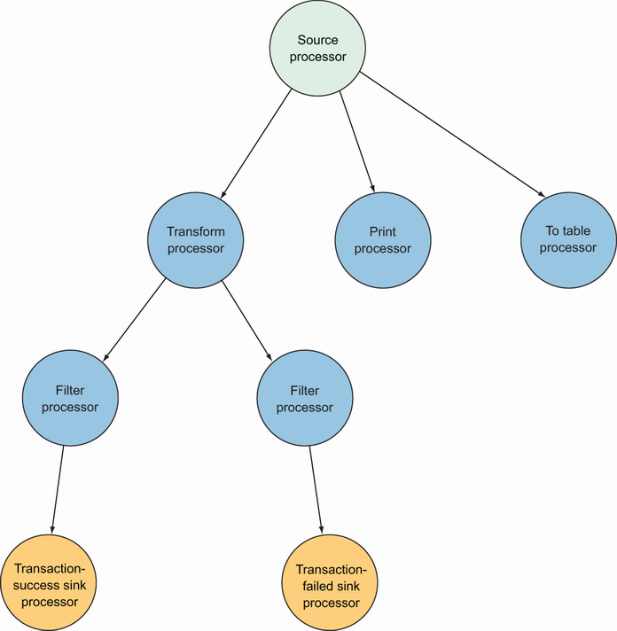
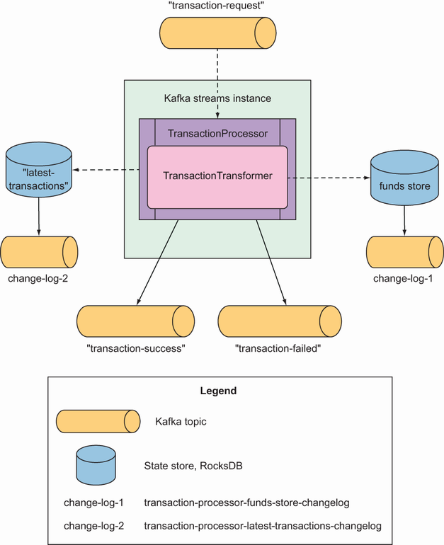
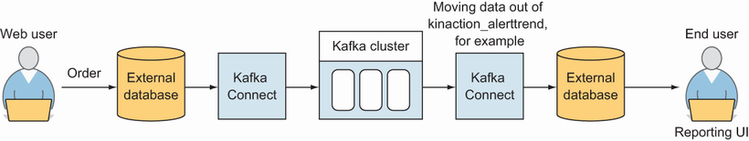
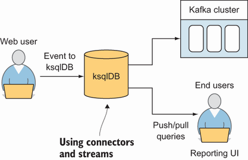

# 12 Stream processing with Kafka Streams and ksqlDB
This chapter covers

* Getting started with Kafka Streams
* Using basic Kafka Streams APIs
* Using state stores for persistent storage
* Enriching transaction streams

So far on our path in learning about Kafka, we’ve focused on the parts that help make a complete event-streaming platform, including the Kafka brokers, producer clients, and consumer clients. With this foundation, we can expand our toolset and understand the next layer of the Kafka ecosystem—stream processing using Kafka Streams and ksqlDB. These technologies offer abstractions, APIs, and DSLs (domain-specific languages), based on the foundation that we have built on in the previous chapters.

This chapter introduces a simple banking application that processes funds as they move in and out of the accounts. In our application, we will implement a Kafka Streams topology to process the transaction requests submitted to the transaction-request topic atomically.

> **⚠ NOTE:** NOTE Our business requirement states that we must check whether the funds are sufficient for every request received before updating the account’s balance that’s being processed. As per our requirements, our application can’t process two transactions simultaneously for the same account, which could create a race condition in which we cannot guarantee we can enforce the balance check before withdrawing funds.

We will use Kafka’s inter-partition ordering guarantees to implement serializable (ordered) processing of transactions for a particular account. We also have a data generator program that writes simulated transaction requests to the Kafka topic with a key equal to the transaction’s account number. We can, therefore, ensure all transactions will be processed by a single instance of our transaction service, no matter how many applications are concurrently running. Kafka Streams won’t commit any message offset until it completes our business logic of managing a transaction request.

We introduce the Processor API by implementing a transformer component from Kafka Streams. This utility allows us to process events one by one while interacting with a state store, another element of Kafka Streams that helps us persist our account balance in a local instance of an embedded database, RocksDB. Finally, we will write a second stream processor to generate a detailed transaction statement enriched with account details. Rather than creating another Kafka Streams application, we will use ksqlDB to declare a stream processor that will enrich our transactional data in real time with our referential data coming from the account topic.

This section aims to show how we can use an SQL-like query language to create stream processors (with functionality similar to Kafka Streams) without compiling and running any code. We’ll dig into the Kafka Streams API’s details after reviewing the concepts of stream-processing applications.

## 12.1 Kafka Streams
In general, stream processing (or streaming) is a process or application you implement that deals with an uninterrupted flow of data and performs work as soon as that data arrives, as discussed in chapter 2. This application does not execute on a regular schedule or even query a database for data. Views can be created from the data, but we are not limited to a point-in-time view. Enter Kafka Streams!

Kafka Streams is a library and not a standalone cluster [1]. Notice that this description includes the word library. This alone can help us create stream processing for our applications. No other infrastructure is required besides the need to utilize an existing Kafka cluster [2]. The Kafka Streams library is a part of our JVM-based application.

Not having additional components makes this API one that can be easily tested when starting with a new application. Though other frameworks might require more cluster management components, Kafka Streams applications can be built and deployed using any tool or platform that allows JVM-based applications to run.

> **⚠ NOTE:** Our application won’t run on the brokers of our cluster. For that reason, we will run our application outside the Kafka cluster. This approach guarantees the separation of concerns in resource management for Kafka brokers and stream processors.

The Streams API performs per-record or per-message processing [3]. You won’t want to wait for a batch to form or delay that work if you’re concerned about your system reacting to events as soon as they are received.

As we consider how to implement our applications, one of the first questions that comes to mind is choosing a producer/consumer client for the Kafka Streams library. Although the Producer API is excellent for taking precise control of how our data gets to Kafka and the Consumer API for consuming events, sometimes we might not want to implement every aspect of the stream-processing framework ourselves. Instead of using lower-level APIs for stream processing, we want to use an abstraction layer that allows us to work with our topics more efficiently.

Kafka Streams might be a perfect option if our requirements include data transformations with potentially complex logic consuming and producing data back into Kafka. Streams offer a choice between a functional DSL and the more imperative Processor API [2]. Let’s take a first look at the Kafka Streams DSL.

> ## Domain-specific languages (DSLs)
> 
> DSLs are meant to provide a language that makes it easier to work with a specific subject. SQL (used commonly with databases) and HTML (used for creating web pages) are good examples of languages to consider using with DSLs (see https://martinfowler.com/dsl.html). Although the official Kafka Streams documentation refers to the high-level Kafka Streams API as a DSL, we like to refer to it as a fluent API or, as Martin Fowler describes it, a fluent interface (see https://martin fowler.com/bliki/FluentInterface.html).

### 12.1.1 KStreams API DSL
The first API that we’re going to look at is the KStreams API. Kafka Streams is a data-processing system designed around the concept of a graph, one that doesn’t have any cycles in it [2]. It has a starting node and an ending node, and data flows from the starting node to the ending node. Along the way, nodes (or processors) process and transform the data. Let’s take a look at a scenario where we can model a data-processing process as a graph.

We have an application that gets transactions from a payment system. At the beginning of our graph, we need a source for this data. Because we’re using Kafka as a data source, a Kafka topic will be our starting point. This origin point is often referred to as a source processor (or source node). This starts the processing; there aren’t any previous processors. Our first example, therefore, is an existing service that captures transactions from an external payment system and places transaction request events into a topic.

> **⚠ NOTE:** We will simulate this behavior with a simple data generator application.

A transaction request event is needed to update the balance for a particular account. The results of the transaction processor go into two Kafka topics: successful transactions land in transaction-success and unsuccessful transactions land in transaction-failure. Because this is the end of the road for our small application, we will create a pair of sink processors (or sink nodes) to write to our success or failure topics.

NOTE Some processor nodes may not have a connection to sink nodes. In this case, those nodes create side effects elsewhere (e.g., printing information to the console or writing data to the state stores) and do not require sending data back to Kafka.

Figure 12.1 shows a DAG (directed acyclic graph) representation of how data flows. Figure 12.2 shows you how this DAG maps out to the Kafka Streams topology.

  
Figure 12.1 DAG (directed acyclic graph) of our stream-processing application

  
Figure 12.2 Topology for your transaction-processing application

Now that we have a map for a guide, let’s look at what this application looks like with the DSL code. Unlike our earlier examples, when using this API, we don’t need to reach a consumer directly to read our messages, but we can use a builder to start creating our stream. Listing 12.1 shows the creation of a source processor.

> **⚠ IMPORTANT:**  At this point, we’re defining our topology, but not invoking it, as processing hasn’t started yet.

In the listing, we use a StreamsBuilder object in order to create a stream from the Kafka topic transaction-request. Our data source is transaction-request and is the logical starting point for our processing.

Listing 12.1 Source topic DSL definition
```java
StreamsBuilder builder = new StreamsBuilder()       ❶
 
KStream<String, Transaction> transactionStream =    ❷
  builder.stream("transaction-request", Consumed.with(stringSerde, transactionRequestAvroSerde));
```

❶ The starting point for building our topology

❷ Builds a KStream object for transaction-request to start our processing from this topic

The next step is to add to our topology using the KStream that we created from the source processor. The following listing shows this task.

Listing 12.2 Processor and sink topic definition
```java
final KStream<String, TransactionResult> resultStream =
        transactionStream.transformValues(                             ❶
          () -> new TransactionTransformer()
        );
 
    resultStream
        .filter(TransactionProcessor::success)
        .to(this.transactionSuccessTopicName,
          Produced.with(Serdes.String(), transactionResultAvroSerde));
 
    resultStream
        .filterNot(TransactionProcessor::success)                      ❷
        .to(this.transactionFailedTopicName,
          Produced.with(Serdes.String(), transactionResultAvroSerde));
 
KafkaStreams kafkaStreams =                                            ❸
➥ new KafkaStreams(builder.build(), kaProperties);
kafkaStreams.start();                                                  ❹
...
kafkaStreams.close();                                                  ❺
```

❶ Continues building our topology using the stream created from the previous source processor

❷ Depending on the transaction success criteria, our sink processor writes to one of two topics: transaction-success or transaction-failed.

❸ Passes our topology and configuration to create a KafkaStreams object

❹ Starts our stream application, which continues in the same way as if we had consumer clients polled in an infinite loop

❺ Closes the stream to stop processing

Although we have only one processing node, which doesn’t involve reading and writing data, it is easy to see how we could chain multiple nodes on our path. Looking over the code in listing 12.2, you might notice the lack of direct usage of the following:

* A consumer client to read from the source topic as in chapter 5
* A producer client to send our messages at the end of the flow as in chapter 4

This layer of abstraction allows us to work on our logic rather than the details. Let’s look at another practical example. Imagine we simply want to log transaction requests in the console without processing them. The following listing shows the reading of transaction events from the transaction-request topic.

Listing 12.3 Transaction tracker KStream
```java
KStream<String, Transaction> transactionStream =
  builder.stream("transaction-request",                                    ❶
                 Consumed.with(stringSerde, transactionRequestAvroSerde));
 
    transactionStream.print(Printed.<String, Transaction>toSysOut()
      .withLabel("transactions logger"));                                  ❷
 
KafkaStreams kafkaStreams = new KafkaStreams(builder.build(), kaProperties);
kafkaStreams.cleanUp();                                                    ❸
kafkaStreams.start();
...
```

❶ Sources our data from the topic transaction-request and uses a custom Transaction object to hold our data

❷ Prints the transactions as we get them, so we can more easily follow along with the example

❸ Cleans up the local data store, ensuring that we run without the past state

This flow is so simple that we just write out the transactions to the console, but we could have used an API call to send an SMS or email as well. Notice the added call to cleanup() before starting the application. This method provides a way to remove the local state stores for our application. Just remember to only do this before the start or after closing the application.

Despite the ease of use of KStreams, they are not the only way we can process our data. The KTable API provides us with an alternative to always add events to our view by representing data as updates instead.

### 12.1.2 KTable API
Although a KStream can be thought of as event data always being appended to our log, a KTable allows us to think about a log-compacted topic [2]. In fact, we can also draw a parallel to a database table that deals with updates in place. Recall from working with compacted topics in chapter 7 that our data needs to have a key for this to work. Without a key, the value to be updated won’t really make practical sense. Running the code in the following listing, we see that not every order event shows up. Instead, we see only the distinct orders.

Listing 12.4 Transaction KTable
```java
StreamsBuilder builder = new StreamsBuilder();
 
KTable<String, Transaction> transactionStream =
  builder.stream("transaction-request",                                   ❶
                 Consumed.with(stringSerde, transactionRequestAvroSerde),
            Materialized.as("latest-transactions"));                      ❷
 
KafkaStreams kafkaStreams = new KafkaStreams(builder.build(), kaProperties);
```

❶ StreamsBuilder.table() creates a KTable from the topic transaction-request.

❷ KTable records materialize locally in the latest-transactions state store.

What is familiar with this listing is the way we build the stream. We use a builder to create the steps and then, once it is defined, we call start. Until that moment, nothing processes in our application.

### 12.1.3 GlobalKTable API
Although similar to KTable, the GlobalKTable is populated with data from all partitions of a topic [2]. The foundational knowledge about topics and partitions pays off when understanding these abstractions, as shown in how the KafkaStreams instances consume each partition of a topic. Listing 12.5 is an example of using a join with a GlobalKTable. Imagine a stream that gets updated with details about a mailed package for a customer. These events contain the customer ID, and we can then join on a customer table to find their associated email and send a message.

Listing 12.5 Mailing notification GlobalKTable
```java
...
StreamsBuilder builder = new StreamsBuilder();
 
final KStream<String, MailingNotif> notifiers =
  builder.stream("kinaction_mailingNotif");                ❶
final GlobalKTable<String, Customer> customers =
  builder.globalTable("kinaction_custinfo");               ❷
 
lists.join(customers,                                      ❸
    (mailingNotifID, mailing) -> mailing.getCustomerId(),
    (mailing, customer) -> new Email(mailing, customer))
    .peek((key, email) ->
        emailService.sendMessage(email));
 
KafkaStreams kafkaStreams = new KafkaStreams(builder.build(), kaProperties);
kafkaStreams.cleanUp();
kafkaStreams.start();
...
```
❶ The notification stream listens for new messages about mailings to send to a customer.

❷ GlobalKTable holds a list of Customer information, including email.

❸ The join method matches the customer that needs to be notified with an email.

As shown in listing 12.5, we can build a new GlobalKTable using the method globalTable. Whereas a table that is not global might not consume all the input topic’s data due to multiple partitions, the global table consumes all partitions for your running code [2].

> **⚠ NOTE:** The idea of a global table is to make the data available to our application regardless of which partition it is mapped to.

Even though the Streams DSL has been excellent for quick use cases, sometimes we might need more control as we send data along our logic paths. Developers can use the Processor API alone or with the Streams DSL to provide even more options.

### 12.1.4 Processor API
It’s important to note that when reviewing code for another streaming application or even looking at getting into lower abstraction levels in our own logic, we might run into examples from the Processor API. This is considered not as easy to use as the DSL discussed in the previous sections, but it gives us more options and power over our logic [2]. Let’s look at an example in the following listing, where we create a topology and highlight the differences from our previous Streams applications.

Listing 12.6 Processor API source
```java
import static org.apache.kafka.streams.Topology.AutoOffsetReset.LATEST;
 
public static void main(String[] args) throws Exception {
//...
final Serde<String> stringSerde = Serdes.String();
Deserializer<String> stringDeserializer = stringSerde.deserializer();
Serializer<String> stringSerializer = stringSerde.serializer();
 
Topology topology = new Topology();       ❶
 
topology = topology.addSource(LATEST,     ❷
  "kinaction_source",                     ❸
  stringDeserializer,                     ❹
  stringDeserializer,                     ❺
  "kinaction_source_topic");              ❻
}
//...
```
❶ Creates our flow with the Topology object

❷ Sets the offset to LATEST

❸ Names the node that we can refer to in later steps

❹ Deserializes our key

❺ Deserializes our value

❻ Reads from this Kafka topic

First, we build our graph using the Topology object [4]. Setting the offset to LATEST and listing our key and value deserializers should be familiar from when we set configuration properties for our client consumers in chapter 5. In listing 12.6, we named the node kinaction_source, which reads from the topic kinaction_source_topic. Our next step is to add a processing node, as the following listing shows.

Listing 12.7 Processor API processor node
```java
topology = topology.addProcessor(
             "kinactionTestProcessor",    ❶
  () -> new TestProcessor(),              ❷
  "kinaction_source");                    ❸
```
❶ Names our new processor node

❷ Creates a processor instance from a ProcessorSupplier

❸ One or a list of nodes sends data to this node.

Listing 12.7 shows that when we define a processing node, we give it a name (kinactionTestProcessor, in this case) and associate the logic with the step. We also list the nodes that will provide the data.

To finish out our simple example, let’s look at listing 12.8. It shows how we define two separate sinks to complete our topology. The sink is where we place our data at the end of processing. The topic name and the key and value serializers should be familiar from our earlier work with producer clients. As we did with the other parts of the topology, we define kinactionTestProcessor as one of the nodes from which we will get data in our flow.

Listing 12.8 Processor API processor sink
```java
topology = topology.addSink(
             "Kinaction-Destination1-Topic",       ❶
  "kinaction_destination1_topic",                  ❷
  stringSerializer,                                ❸
  stringSerializer,                                ❹
  "kinactionTestProcessor");                       ❺
 
topology = topology.addSink(
             "Kinaction-Destination2-Topic",       ❻
  "kinaction_destination2_topic",
  stringSerializer,
  stringSerializer,
  "kinactionTestProcessor");
 
...
```
❶ Names a sink node

❷ Names the output topic we plan to use

❸ Serializes our key

❹ Serializes our value

❺ Defines the node that feeds us data to write to the sink

❻ Adds a second sink to our topology

In our Processor code, we’re going to show how we can use logic to direct the flow of our data. Our kinactionTestProcessor enables us to forward the flow, including the key and value, to the sink named Kinaction-Destination2-Topic. Although this is hardcoded in the following listing, we can use logic to determine when to send data to the second sink.

Listing 12.9 Processor custom code
```java
public class KinactionTestProcessor
  extends AbstractProcessor<String, String> {         ❶
    @Override
    public void process(String key, String value) {
      context().forward(key, value,                   ❷
        To.child("Kinaction-Destination2-Topic"));
    }
}
```
❶ Extends AbstractProcessor to implement the process method for our custom logic

❷ Hardcoded value, but we can also direct the forward with additional logic

Even though it’s easy to see that the code is more verbose than our DSL examples, the important thing is the control we now have in our logic that was not shown in our simple flow with the DSL API. If we want to control the schedule of when processing occurs or even the commit time for results, we’ll need to dig into more complex Processor API methods.

### 12.1.5 Kafka Streams setup
While our example application only uses a single instance, streaming applications can scale by increasing the number of threads and deploying more than one instance. As with the number of instances of a consumer in the same consumer group, our application’s parallelism is related to the number of partitions in its source topic [5]. For example, if our starting input topic has eight partitions, we would plan to scale to eight instances of our application. Unless we want to have an instance ready in case of failure, we won’t have more instances because they won’t take any traffic.

When we think about our application’s design, it is crucial to mention the processing guarantees that our use case requires. Kafka Streams supports at-least-once and exactly-once processing semantics.

> **⚠ NOTE:** In version 2.6.0, exactly-once beta was introduced. This version enables higher throughput and scalability by attempting to reduce resource utilization [6].

If your application logic depends on exactly-once semantics, having your Kafka Streams application within the walls of the Kafka ecosystem helps ensure this possibility. As soon as you send data outside into external systems, you need to look at how they achieve any promised delivery options. Whereas the Streams API can treat retrieving topic data, updating the stores, and writing to another topic as one atomic operation, external systems cannot. System boundaries become significant when they impact your guarantees.

As a reminder, with at-least-once delivery, it is crucial to note that although data should not be lost, you might have to prepare for the situation where your messages are processed more than once. At the time of writing, at-least-once delivery is the default mode, so make sure you’re okay with addressing duplicate data in your application logic.

Kafka Streams is designed with fault tolerance in mind. It does so in the ways that we have seen before in our Kafka cluster. The state stores in use are backed by a replicated Kafka topic that is partitioned. Due to Kafka’s ability to retain messages and replay what happened before a failure, users can successfully continue without manually recreating their state. If you’re interested in continuing deeper into what Kafka Streams can offer, we recommend Kafka Streams in Action (https://www.manning.com/books/kafka-streams-in-action) by William P. Bejeck Jr. (Manning, 2018) because it dives further into the details.

## 12.2 ksqlDB: An event-streaming database
ksqlDB (https://ksqldb.io) is an event-streaming database. This product was first introduced as KSQL, but the project underwent a name change in November 2019. Apache Kafka has developed various clients to help make our data work easier.

ksqlDB exposes the power of Kafka to anyone who has ever used SQL. Suddenly, no Java or Scala code is needed to use the topics and data inside our clusters. Another primary driver is that as users worked with the entire application lifecycle, it was often the case that Kafka provided a part of the flow and not the whole architecture needed. Figure 12.3 shows an example of one way that we could utilize Kafka.

  
Figure 12.3 Example Kafka application flow

Notice that to serve users, the data from Kafka is moved into an external data store. For example, imagine an application that triggers an order in an e-commerce system. An event is triggered for each stage of the order process and acts as a status for the purchaser to know what is happening with their order in a report.


  
Figure 12.4 ksqlDB example Kafka application flow

Before ksqlDB, it was often the case that the order events would be stored in Kafka (and processed with Kafka Streams or Apache Spark) and then moved to the external system using the Kafka Connect API. The application would then read from that database the view created from the event stream to show the user as a point-in-time state. With the pull query and connector management features added to ksqlDB, developers gained a path to remain within the ecosystem to show users these materialized views. Figure 12.4 shows a high-level overview of how the Kafka ecosystem can provide a more consolidated application without the need for external systems.We’ll dig into the types of queries that ksqlDB supports, starting with the pull queries that we just introduced.

### 12.2.1 Queries
Pull queries and push queries can help us build applications. Pull queries fit well when used in a synchronous flow like request-and-response patterns [7]. We can ask for the current state of the view that has been materialized by events that have arrived. The query returns a response and is considered completed. Most developers are familiar with this pattern and should know that the data is a point snapshot of their events when the query was retrieved.

Push queries, on the other hand, can work well when used in asynchronous patterns [7]. In effect, we subscribe much like we did when using a consumer client. As new events arrive, our code can respond with the necessary actions.

### 12.2.2 Local development
Although we’ve tried to avoid bringing in extra technologies besides Kafka proper, the easiest way to go with ksqlDB local is with Confluent’s Docker images. At https://ksqldb.io/quickstart.html you can download images that include a complete Kafka setup or just the ksqldb-server and ksqldb-cli files.

If you’re using the Docker images, you can start those images with docker-compose up. Now you should be able to use ksqldb-cli to create an interactive session from your command terminal to your KSQL server. As users know, after you have your database server, you need to define your data. For more information on running Kafka and tools using Docker, see appendix A. The following listing shows the command we can run in order to leverage Docker to start an interactive ksqlDB session [8].

Listing 12.10 Creating an interactive session with ksqlDB
```shell
docker exec -it ksqldb-cli \
  ksql http://ksqldb-server:8088        ❶
> SET 'auto.offset.reset'='earliest';   ❷
```
❶ Connects to the ksqlDB server to run commands from your terminal

❷ Sets the offset reset policy to earliest, letting ksqlDB process data already available in Kafka topics

Next, let’s look at an example of a situation where we can start to discover ksqlDB with an extension of our transaction processor. Using existing data from processed transactions, we’ll learn how we can generate a statement report. The statement report includes extended (or enriched) information about the transaction’s account. We will achieve this by joining successful transactions with account data. Let’s start with creating a stream of a successful transactions from Kafka’s topic.

> **⚠ NOTE:**  Because data was previously available in a Kafka topic from our Kafka Streams application, we may need to reset the offset with the command SET 'auto.offset.reset' = 'earliest'; so ksqlDB will be able to work with the existing data. We’ll need to run this command before we execute the CREATE statement. Listing 12.11 shows our next step in the process, creating a stream for transaction success that reads from the topic transaction-success.

Listing 12.11 Creating a stream for successful transactions
```sql
CREATE STREAM TRANSACTION_SUCCESS (
  numkey string KEY,                                   ❶
  transaction STRUCT<guid STRING, account STRING,      ❷
                    amount DECIMAL(9, 2), type STRING,
                    currency STRING, country STRING>,
  funds STRUCT<account STRING,
               balance DECIMAL(9, 2)>,
  success boolean,
  errorType STRING
) WITH (
  KAFKA_TOPIC='transaction-success',                   ❸
  VALUE_FORMAT='avro');                                ❹
```
❶ Tells ksqlDB about the record key

❷ ksqlDB supports work with nested data.

❸ Using the KAFKA_TOPIC attribute of the WITH clause, specifies which topic to read from

❹ Integrates ksqlDB with schemas in Avro

Because ksqlDB supports work with nested data, we used a nested type Transaction in the TransactionResult class in our Kafka Streams example. Using the STRUCT keyword, we defined a structure of a nested type. Additionally, ksqlDB integrates with the Confluent Schema Registry and natively supports schemas in Avro, Protobuf, JSON, and JSON-schema formats. Using this Schema Registry integration, ksqlDB can use schemas to infer or discover stream or table structures in many cases. This is a tremendous help for enabling effective collaboration between microservices, for example.

As mentioned, we need to use comprehensive information about accounts. In contrast to the history of successful transactions, we are not interested in a complete history of account information changes. We just need to have a lookup of accounts by account ID. For that purpose, we can use TABLE in ksqlDB. The following listing shows how to do this.

Listing 12.12 Creating a ksqlDB table
```sql
CREATE TABLE ACCOUNT (number INT PRIMARY KEY)          ❶
WITH (KAFKA_TOPIC = 'account', VALUE_FORMAT='avro');   ❷
```
❶ Chooses the account number field as a primary key for our table

❷ Using the Avro schema, ksqlDB learns about fields in the account table.

The next step is to populate our table. Despite the SQL statement in listing 12.13 looking similar to SQL statements you may have run in the past, we want to draw your attention to a small but mighty difference. The use of EMIT CHANGES creates what we had previously discussed as a push query. Instead of returning to our command prompt, this stream runs in the background!

Listing 12.13 A transaction statement stream with account information
```sql
CREATE STREAM TRANSACTION_STATEMENT AS
    SELECT *
    FROM TRANSACTION_SUCCESS
    LEFT JOIN ACCOUNT
        ON TRANSACTION_SUCCESS.numkey = ACCOUNT.numkey
    EMIT CHANGES;
```
To test our query, we need a new instance of the ksqldb-cli file to insert data into our stream to continue producing test transactions. The Kafka Streams application processes those transactions. In case of success, the Kafka Streams processor writes the result to a transaction-success topic, where it will be picked up by ksqlDB and used in TRANSACTION_SUCCESS and TRANSACTION_STATEMENT streams.

### 12.2.3 ksqlDB architecture
By using the Docker images, we glossed over the architecture that is part of ksqlDB. But it’s important to know that unlike the Streams API, ksqlDB requires additional components to run. The main component is called the ksqlDB server [9]. This server is responsible for running the SQL queries submitted to it and getting data to and from our Kafka cluster. In addition to the query engine, a REST API also is provided. This API is used by the ksqldb-cli file that we used in the examples [9].

Another item that we should consider is one of the deployment modes. Called headless, this mode prohibits developers from running queries through the command line interface [10]. To configure this mode, we can either start the ksqlDB server with the --queries-file command line argument or update the ksql-server.properties file [10]. Of course, this means that a query file is also required. The following listing shows how to start ksqlDB in headless mode [10].

Listing 12.14 Starting ksqlDB in headless mode
```shell
bin/ksql-server-start.sh \                                   ❶
etc/ksql/ksql-server.properties --queries-file kinaction.sql
```
❶ Starts ksqlDB in a non-interactive mode in which the CLI will not work

Now that we have used Kafka Streams and ksqlDB, how do we know which one to reach for as we approach new tasks? Though not a read-eval-print loop (REPL) directly, running some quick prototype tests and trials with ksqldb-cli might be a great way to start new applications. Another key for ksqlDB is that users who are not running Java or Scala (JVM languages) can find the Kafka Streams feature set available with this SQL option. Users looking to build microservices would likely find the Streams API a better fit.

## 12.3 Going further
Even though we just introduced Kafka Streams and ksqlDB, there are still many more resources to help you continue your Kafka learning. The following sections look at a few of those resources.

### 12.3.1 Kafka Improvement Proposals (KIPs)
While it might not seem like the most exciting option, following Kafka Improvement Proposals (KIPs) is really one of the best ways to keep current with Kafka. Even though not everything that gets proposed is implemented, it is interesting to see what other users of Kafka think is worth exploring as use cases change over time.

As we saw in chapter 5, KIP 392 (http://mng.bz/n2aV) was motivated by the need for users to fetch data when the partition leader was in a nonlocal data center. If Kafka existed only in on-premises data centers without separate data centers for disaster recovery, the proposal might not have gained acceptance. Reviewing these new KIPs allows everyone to understand the issues or features fellow Kafka users experience in their day-to-day life. KIPs are important enough to be addressed and discussed in keynotes such as the Kafka Summit 2019, where KIP 500 (http://mng.bz/8WvD) was presented. This KIP deals with the replacement of ZooKeeper.

### 12.3.2 Kafka projects you can explore
In addition to Kafka source code, searching GitHub or GitLab public repositories for real-world uses of Kafka can help you learn from those projects. Although not all code is equal in quality, hopefully, the previous chapters have given you enough information to understand how the required pieces fall into place. This book pointed out a couple of projects that use Kafka in some part to help power software, and these have made their source code publicly viewable on GitHub. One example was Apache Flume (https://github.com/apache/flume).

### 12.3.3 Community Slack channel
If you like a more interactive way to gather information and a great place to search for or ask questions, visit the Confluent Community page (https://www.confluent.io/community/). You’ll find a Slack group with channels focusing on Kafka’s specific parts, such as clients, Connect, and many other Kafka topics. The number of detailed questions that others have posted (and that you can post) shows the breadth of experiences users are willing to explore and share. There is also a community forum where you can introduce yourself and meet other vibrant members.

Throughout this chapter, you have expanded your knowledge to learn about the further abstractions of KStreams and ksqlDB and how these relate to your core knowledge of Kafka. As the Kafka ecosystem evolves and changes, or even adds new products, we are confident that Kafka’s foundations presented here will help you understand what is going on internally. Good luck on your continuing Kafka learnings!

# Summary
* Kafka Streams provides stream processing in applications with per-record (or per-message) processing. It is an abstraction layer over the producer and consumer clients.
* Kafka Streams offers a choice between a functional DSL (domain-specific language) and the Processor API.
* Streams can be modeled as a topology using the Kafka Streams DSLs.
* ksqlDB is a database that exposes the power of Kafka to those who already know SQL. ksqlDB queries run continuously and can help us quickly prototype streaming applications.
* Kafka Improvement Proposals (KIPs) are a great way to see what changes are being requested and implemented in future Kafka versions.

# References
1. “Documentation: Kafka Streams.” Apache Software Foundation (n.d.). https://kafka.apache.org/documentation/streams/ (accessed May 30, 2021).
1. “Streams Concepts.” Confluent documentation (n.d.). https://docs.confluent.io/platform/current/streams/concepts.html (accessed June 17, 2020).
1. “Documentation: Kafka Streams: Core Concepts.” Apache Software Foundation (n.d.). https://kafka.apache.org/26/documentation/streams/core-concepts (accessed June 25, 2021).
1. “Kafka Streams Processor API.” Confluent documentation (n.d.). https://docs.confluent.io/platform/current/streams/developer-guide/processor-api.html#streams-developer-guide-processor-api (accessed August 22, 2021).
1. “Streams Architecture.” Confluent documentation (n.d.). https://docs.confluent.io/platform/current/streams/architecture.html (accessed June 17, 2020).
1. “Documentation: Streams API changes in 2.6.0.” Apache Software Foundation. https://kafka.apache.org/26/documentation/streams/upgrade-guide#streams_api_changes_260 (accessed August 22, 2021).
1. “ksqlDB Documentation: Queries.” Confluent documentation (n.d.). https://docs.ksqldb.io/en/latest/concepts/queries/ (accessed May 5, 2021).
1. “ksqlDB: Configure ksqlDB CLI.” Confluent documentation (n.d.). https://docs.ksqldb.io/en/0.7.1-ksqldb/operate-and-deploy/installation/cli-config/ (accessed August 23, 2021).
1. “Installing ksqlDB.” Confluent documentation (n.d.). https://docs.confluent.io/platform/current/ksqldb/installing.html (accessed June 20, 2020).
1. “Configure ksqlDB Server.” Confluent documentation (n.d.). https://docs.ksqldb.io/en/latest/operate-and-deploy/installation/server-config/ (accessed August 23, 2021).