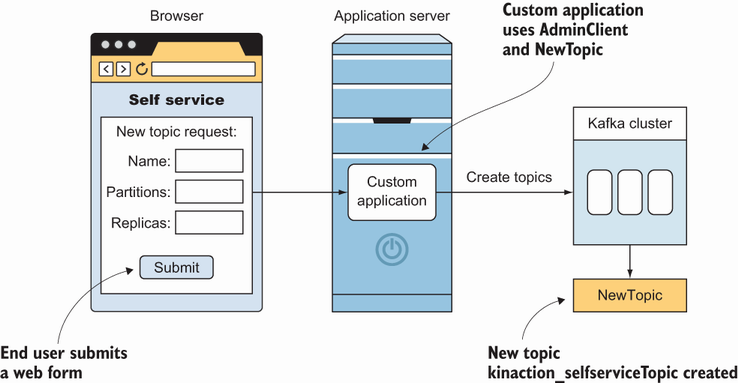
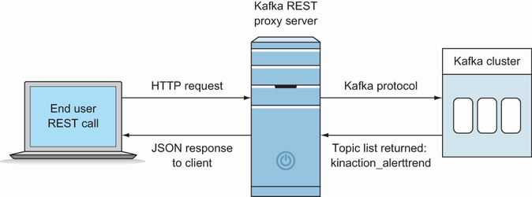
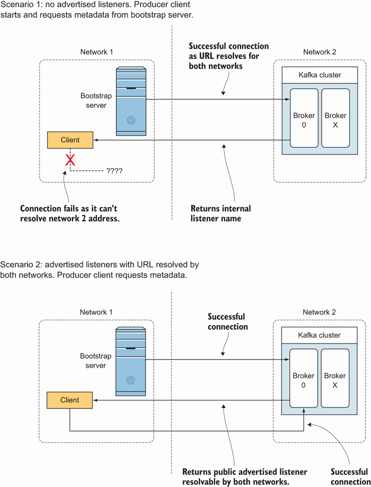
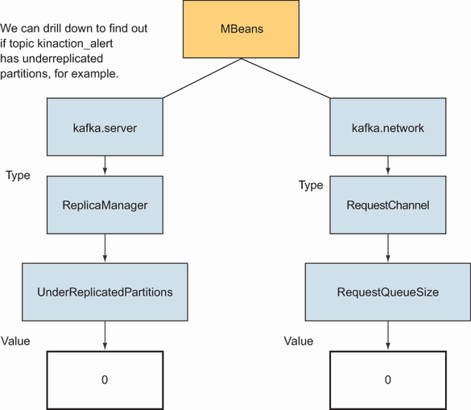
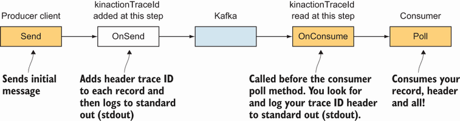

# 9 Management: Tools and logging
This chapters covers

* Scripting administration client options
* Examining REST APIs, tools, and utilities
* Managing Kafka and ZooKeeper logs
* Finding JMX metrics
* Advertised listeners and clients
* Tracing using interceptors with headers

We have spent some time discussing brokers in depth in chapter 6 and client concerns throughout the earlier chapters. We saw some development practices that can be applied in most situations, but there will always be environments where special handling is required. The best way to keep a cluster moving along is to understand the data that is flowing through it and to monitor that activity at run time. Although operating Apache Kafka may not be the same as writing and running Java applications per se, it still requires monitoring log files and being aware of what is happening with our workloads.

## 9.1 Administration clients
So far, we have performed most of our cluster management activities with the command line tools that come with Kafka. And, in general, we need to be comfortable with a shell environment to set up and install Kafka. However, there are some helpful options we can use to branch out from these provided scripts.

### 9.1.1 Administration in code with AdminClient
One useful tool to look at is the AdminClient class [1]. Although the Kafka shell scripts are great to have at hand for quick access or one-off tasks, there are situations such as automation where the Java AdminClient really shines. The AdminClient is in the same kafka-clients.jar that we used for the producer and consumer clients. It can be pulled into a Maven project (see the pom.xml from chapter 2,) or it can be found in the share/ or libs/ directory of the Kafka installation.

Let’s look at how we can execute a command we have used before to create a new topic but this time with AdminClient. The following listing shows how we ran this from the command line in chapter 2.

Listing 9.1 Creating the kinaction_selfserviceTopic topic from the command line
```shell
bin/kafka-topics.sh
  --create --topic kinaction_selfserviceTopic \    ❶
  --bootstrap-server localhost:9094 \
  --partitions 2 \                                 ❷
  --replication-factor 2                           ❷
```
❶ Uses the kafka-topic.sh script to create a new topic

❷ Includes our custom integers for the number of partitions and replicas for our topic

Though this command line example works fine, we don’t want it to be called every time someone needs a new topic. Instead, we’ll create a self-service portal that other developers can use to create new topics on our development cluster. The form for our application takes a topic name and the numbers for partitions and replicas. Figure 9.1 shows an example of how this application might be set up for end users. Once the user submits the web form, the AdminClient Java code runs, creating a new topic.

In this example, we could add logic to make sure that naming conventions for new topics fit a certain pattern (if we had such a business requirement). This is a way to maintain more control over our cluster rather than users working from the command line tools. To start, we need to create a NewTopic class. The constructor for this class takes three arguments:

* Topic name
* The number of partitions
* The number of replicas

  
Figure 9.1 Self-service Kafka web application

Once we have this information, we can use the AdminClient object to complete the work. AdminClient takes a Properties object that contains the same properties we’ve used with other clients, like bootstrap.servers and client.id. Note that the class AdminClientConfig (http://mng.bz/8065) holds constants for configuration values such as BOOTSTRAP_SERVERS_CONFIG as a helper for those names. Then we’ll call the method createTopics on the client. Notice that the result, topicResult, is a Future object. The following listing shows how to use the AdminClient class to create a new topic called kinaction_selfserviceTopic.

Listing 9.2 Using AdminClient to create a topic
```java
NewTopic requestedTopic =
  new NewTopic("kinaction_selfserviceTopic", 2,(short) 2);    ❶
 
AdminClient client =
  AdminClient.create(kaProperties);                           ❷
CreateTopicsResult topicResult =
client.createTopics(
  List.of(requestedTopic));                                   ❸
  topicResult.values().
    get("kinaction_selfserviceTopic").get();                  ❹
```
❶ Creates a NewTopic object with the topic name, two partitions, and two replicas

❷ Creates an AdminClient, the client interface to the cluster

❸ Invokes createTopics on the client to return a Future object

❹ Shows how to get a specific Future for the topic kinaction_selfserviceTopic

At this time, there is no synchronous API, but we can make a synchronous call by using the get() function. In our case, that would mean starting with the topicResult variable and evaluating the Future object that was returned for the specific topic. Because this API is still evolving, the following list of client administrative tasks that can be accomplished with AdminClient highlights only a few common functions that are available at the time of writing [1]:

* Change configurations
* Create/delete/list access control lists (ACLs)
* Create partitions
* Create/delete/list topics
* Describe/list consumer groups
* Describe clusters

AdminClient is a great tool for building a user-facing application for those who wouldn’t normally need or want to use the Kafka shell scripts. It also provides a way to control and monitor what is being done on the cluster.

### 9.1.2 kcat
kcat (https://github.com/edenhill/kcat) is a handy tool to have on your workstation, especially when connecting remotely to your clusters. At this time, it focuses on being a producer and consumer client that can also give you metadata about your cluster. If you ever want to quickly work with a topic and don’t have the entire Kafka toolset downloaded to your current machine, this executable helps you avoid the need to have those shell or bat scripts.

The following listing shows how to quickly get data into a topic using kcat [2]. Compare this with the kafka-console-producer script that we used in chapter 2.

Listing 9.3 Using a kcat producer
```shell
kcat -P -b localhost:9094 \
 -t kinaction_selfserviceTopic                  ❶
 
// vs. the shell script we used before
bin/kafka-console-producer.sh --bootstrap-server localhost:9094 \
  --topic kinaction_selfserviceTopic            ❷
```

❶ Sends a broker and topic name from our cluster to write messages to that topic

❷ A reminder of the same functionality as the console producer command

In listing 9.3, notice that the -P argument is passed to kcat to enable producer mode, which helps us send messages to the cluster. We use the -b flag to pass in our broker list and -t to pass the name of our target topic. Because we may also want to test the consumption of these messages, let’s look at how we can use kcat as a consumer (listing 9.4). As before, listing 9.4 shows the comparison between running the kcat command versus the kafka-console-consumer command. Notice also that although the -C flag enables consumer mode, the broker information is sent with the same parameter as in the producer mode [2].

Listing 9.4 Using a kcat consumer
```shell
kcat -C -b localhost:9094 \
 -t kinaction_selfserviceTopic               ❶
 
// vs. the shell script we used before
bin/kafka-console-consumer.sh --bootstrap-server localhost:9094 \
  --topic kinaction_selfserviceTopic         ❷
```
❶ Sends a broker and topic name from our cluster to read messages from that topic

❷ A reminder of the same functionality as the console consumer command

Having a quick way to test our topics and gather metadata on our cluster makes this small utility nice to have in our toolbox. But by this point, you might be wondering if there are any other tools that we can use that are not command line driven. And the good news is yes, there are! For those that like REST, there is Confluent’s REST Proxy.

### 9.1.3 Confluent REST Proxy API
Sometimes the users of our cluster might prefer to use APIs that are RESTful because it is a common way to work between applications, either due to preference or ease of use. Also, some companies with strict firewall rules about ports might express caution with opening more ports like those we’ve used so far for broker connections (for example, 9094) [3]. One good option is to use the Confluent REST Proxy API (figure 9.2). This proxy is a separate application that would likely be hosted on its own server for production usage, and its functionality is similar to the kcat utility we just discussed.
   
Figure 9.1 Self-service Kafka web application

At the time of this writing, the administration functions are limited to querying the state of your cluster. The Confluent documentation lists administration options as future supported features, however [4]. To use the REST proxy and to test drive it, let’s start it up as the following listing shows. For this to work, we need to already have ZooKeeper and Kafka instances running before we start the proxy.

Listing 9.5 Starting up a REST Proxy
```shell
bin/kafka-rest-start.sh \                   ❶
  etc/kafka-rest/kafka-rest.properties
```
❶ Run this command from the installed Kafka folder to start the REST endpoint.

Because we’re already familiar with listing topics, let’s look at how that can be done with the REST Proxy using a command like curl to hit an HTTP endpoint as in the following listing [5]. Because this is a GET request, we can also copy http:/./localhost :8082/topics into a browser and see the result.

Listing 9.6 A cURL call to the REST Proxy for a topic list
```shell
curl -X GET \
 -H "Accept: application/vnd.kafka.v2+json" \         ❶
 localhost:8082/topics                                ❷
 
// Output:
["__confluent.support.metrics","_confluent-metrics",
➥ "_schemas","kinaction_alert"]                      ❸
```
❶ Specifies a format and version

❷ Our target, the endpoint /topics, lists the topics we’ve created and Kafka’s internal topics.

❸ Sample output of the curl command

Using a tool like curl allows us to control the header we send with the request. Accept in listing 9.6 allows us to tell our Kafka cluster what format and version we are using, specifying v2 as the API version and the JSON format that pertains to our metadata requests.

> **⚠ NOTE:**    Because this is an evolving API, keep up with the “Confluent REST Proxy API Reference” at http://mng.bz/q5Nw as newer versions come out with more features.

## 9.2 Running Kafka as a systemd service
One decision we need to make concerning running Kafka is how to perform broker starts and restarts. Those who are used to managing servers as Linux-based services with a tool like Puppet (https://puppet.com/) may be familiar with installing service unit files and can likely use that knowledge to create running instances with systemd. For those not familiar with systemd: it initializes and maintains components throughout the system [6]. One common way to define ZooKeeper and Kafka are as unit files used by systemd.

Listing 9.7 shows part of an example service unit file that starts a ZooKeeper service when the server starts. It also restarts ZooKeeper after an abnormal exit. In practice, this means something like a kill -9 command against the process ID (PID) that triggers a restart of the process. If you installed the Confluent tar during your setup (refer to appendix A if needed), there is an example service file located in the lib/systemd/system/confluent-zookeeper.service path. The “Using Confluent Platform systemd Service Unit Files” documentation at (http://mng.bz/7lG9) provides details on using these files. The unit file in the listing should look familiar to how we have started ZooKeeper so far in our examples.

Listing 9.7 ZooKeeper unit file
```properties
...
[Service]
...
ExecStart=/opt/kafkainaction/bin/zookeeper-server-start.sh 
➥ /opt/kafkainaction/config/zookeeper.properties            ❶
 
ExecStop=
  /opt/kafkainaction/bin/zookeeper-server-stop.sh            ❷
Restart=on-abnormal                                          ❸
...
```
❶ Captures the start command to run ZooKeeper (similar to what we manually ran to start ZooKeeper)

❷ Shuts down the ZooKeeper instance

❸ Runs ExecStart if an error condition causes a failure

There is also an example file for the Kafka service in the Confluent tar in the lib/systemd/system/confluent-kafka.service path. The next listing shows that because our unit files are defined, we can now manage the services with systemctl commands [6].

Listing 9.8 Kafka startup with systemctl
```shell
sudo systemctl start zookeeper     ❶
sudo systemctl start kafka         ❷
```
❶ Starts the ZooKeeper service

❷ Starts the Kafka service

If you are using the example files that came when downloading the Confluent bundle, once you unzip the folder, check inside the root folder, ../lib/systemd/system, to see examples of service files that you can use for other services. Some of these include Connect, the Schema Registry, and the REST API, to name a few.

## 9.3 Logging
Besides Kafka’s event logs that hold our event data, other items that we need to remember are the application logs, which Kafka produces as part of being a running program. The logs addressed in this section are not the events and messages from Kafka servers but the output of the operation of Kafka itself. And we cannot forget about ZooKeeper either!

### 9.3.1 Kafka application logs
Although we might be used to one log file for an entire application, Kafka has multiple log files that we might be interested in or need to access for troubleshooting. Due to multiple files, we might have to look at modifying different Log4j appenders to maintain the necessary views of our operations.

> **⚠ Which Kafka appender?**   
> The kafkaAppender is not the same thing as the KafkaAppender itself (http://mng .bz/5ZpB). To use KafkaLog4jAppender as our appender, we would need to update the following line as well as include dependencies for the clients and appender JARs of the same version instead of the value org.apache.log4j.ConsoleAppender class:
> ```properties 
> log4j.appender.kafkaAppender=org.apache.kafka.log4jappender.KafkaLog4jAppender
> ```
>  
> ```xml 
> <dependency>
>     <groupId>org.apache.kafka</groupId>
>     <artifactId>kafka-log4j-appender</artifactId>
>     <version>2.7.1</version>
> </dependency>
> ```
> This is an interesting take on putting our log files directly into Kafka. Some solutions parse the log files themselves and then send them to Kafka.

By default, the server logs are continually added to the directory as new logs are produced. No logs are removed, however, and this might be the preferred behavior if these files are needed for auditing or troubleshooting. If we want to control the number and size, the easiest way is to update the file log4j.properties before we start the broker server. The following listing sets two important properties for kafkaAppender: MaxFileSize and MaxBackupIndex [7].

Listing 9.9 Kafka server log retention
```properties
log4j.appender.kafkaAppender.MaxFileSize=500KB      ❶
log4j.appender.kafkaAppender.MaxBackupIndex=10      ❷
```

❶ Defines the file size to determine when to create a new log file

❷ Sets the number of older files to keep, which helps if we want more than the current log for troubleshooting

Note that modifying kafkaAppender changes only how the server.log file is treated. If we want to apply different file sizes and backup file numbers for various Kafka-related files, we can use the appender to log a filename table to determine which appenders to update. In table 9.1, the appender name in the left column is the logging key, which affects how the log files on the right are stored on the brokers [8].

Table 9.1 Appender to log pattern
| Appender name       | Log filename         |
|---------------------|----------------------|
| kafkaAppender       | server.log           |
| stateChangeAppender | state-change.log     |
| requestAppender     | kafka-request.log    |
| cleanerAppender     | log-cleaner.log      |
| controllerAppender  | controller.log       |
| authorizerAppender  | kafka-authorizer.log |

Changes to the log4j.properties file require the broker to be restarted, so it is best to determine our logging requirements before starting our brokers for the first time, if possible. We could also change the value with JMX, but the value would not be persistent across broker restarts.

Although we focused on Kafka logs in this section, we need to address our ZooKeeper logs as well. Because ZooKeeper runs and logs data just like our brokers, we will need to be mindful of logging output for those servers as well.

### 9.3.2 ZooKeeper logs
Depending on how we installed and chose to manage ZooKeeper, we may also need to modify its logging configuration. The default configuration for ZooKeeper does not remove log files, but our Kafka install may have added that feature for us. If you followed the setup of our local ZooKeeper node from appendix A, these values can be set in the file config/zookeeper.properties. Either way, it is a good idea to make sure that the retention of the ZooKeeper application logs are controlled by the following configuration values and are what we need for troubleshooting:

* autopurge.purgeInterval—The interval, in hours, in which a purge is triggered. This must be set above 0 for cleanup to occur [9].

* autopurge.snapRetainCount—This contains the number of recent snapshots and the related transaction logs in the dataDir and dataLogDir locations [9]. Once we exceed the number, the older log files are deleted. Depending on our needs, we might want to keep more or fewer. For example, if the logs are only used for troubleshooting, we would need lower retention than if they are needed for audit scenarios.

* snapCount—ZooKeeper logs its transactions to a transaction log. Setting this value determines the amount of transactions that are logged to one file. If there are issues with total file sizes, we might need to set this number less than the default (100,000) [10].

There are other solutions to log rotation and cleanup that we might consider beyond Log4j. For example, logrotate is a helpful tool that enables options such as log rotation and compression of logs files.

Log file maintenance is an important administration duty. However, there are other tasks that we need to consider as we start to roll out a new Kafka cluster. One of these tasks is making sure that clients can connect to our brokers.

## 9.4 Firewalls
Depending on our network configurations, we might need to serve clients that exist inside the network or those out of the network where the Kafka brokers are set up [3]. Kafka brokers can listen on multiple ports. For example, the default for a plain text port is 9092. An SSL port at 9093 can also be set up on that same host. Both of these ports might need to be open, depending on how clients connect to our brokers.

In addition, ZooKeeper includes port 2181 for client connections. Port 2888 is used by follower ZooKeeper nodes to connect to the leader ZooKeeper node, and port 3888 is also used between ZooKeeper nodes to communicate [11]. If connecting remotely for JMX or other Kafka services (such as the REST Proxy), remember to account for any exposure of that port to other environments or users. In general, if we use any command line tools that require a port on the end of the hostname for ZooKeeper or Kafka servers, we need to make sure that these ports can be reached, especially if a firewall is in place.

### 9.4.1 Advertised listeners
One error when connecting that often appears like a firewall issue is using the listeners and advertised.listeners properties. Clients need to use the correct hostname, if given, to connect, so it will need to be a reachable hostname, however the rules are set up. For example, let’s look at listeners versus advertised.listeners where those values might not be the same.

Let’s imagine we are connecting to a broker and can get a connection when the client starts, but not when it attempts to consume messages. How is this behavior that appears inconsistent possible? Remember that when a client starts, it connects to any broker to get metadata about which broker to connect to. The initial connection from the client uses the information that is located in the Kafka listeners configuration. What it gives back to the client to connect to next is the data in Kafka’s advertised .listeners [12]. This makes it likely that the client will connect to a different host to do its work.

Figure 9.3 shows how the client uses one hostname for the first connection attempt, then uses a different hostname on its second connection. This second hostname was given to the client from its initial call as the new location to connect to.

  
Figure 9.3 Kafka’s advertised listeners compared to listeners

An important setting to look at is inter.broker.listener.name, which determines how the brokers connect across the cluster to each other [12]. If the brokers cannot reach each other, replicas fail and the cluster will not be in a good state, to say the least! For an excellent explanation of advertised listeners, check out the article by Robin Moffatt, “Kafka Listeners – Explained,” if you want to dig into more details [12]. Figure 9.3 was inspired by Robin Moffatt's diagrams on that site as well [12].

## 9.5 Metrics
In chapter 6, we looked at an example of setting up a way to see some JMX metrics from our application. The ability to see those metrics is the first step. Let’s take a peek at finding some that are likely to highlight areas of concern.

### 9.5.1 JMX console
It is possible to use a GUI to explore the exposed metrics and get an idea of what is available. VisualVM (https://visualvm.github.io/) is one example. Looking at the available JMX metrics can help us discover points of interest in which we might choose to add alerts. When installing VisualVM, be sure to go through the additional step of installing the MBeans Browser.

As noted in chapter 6, we must have JMX_PORT defined for each broker we want to connect to. This can be done with the environment variable in the terminal like so: export JMX_PORT=49999 [13]. Make sure that you correctly scope it to be separate for each broker as well as each ZooKeeper node.

KAFKA_JMX_OPTS is also another option to look at for connecting remotely to Kafka brokers. Make sure to note the correct port and hostname. Listing 9.10 shows an example that sets KAFKA_JMX_OPTS with various arguments [13]. It uses port 49999 and the localhost as the hostname. In the listing, the other parameters allow us to connect without SSL and to not have to authenticate.

Listing 9.10 Kafka JMX options
```properties
KAFKA_JMX_OPTS="-Djava.rmi.server.hostname=127.0.0.1    ❶
  -Dcom.sun.management.jmxremote.local.only=false       ❷
  -Dcom.sun.management.jmxremote.rmi.port=49999         ❸
  -Dcom.sun.management.jmxremote.authenticate=false     ❹
  -Dcom.sun.management.jmxremote.ssl=false"             ❹
```
❶ Sets the hostname for the localhost RMI server

❷ Allows remote connections

❸ Exposes this port for JMX

❹ Turns off authentication and SSL checks

Let’s take a look at a key broker metric and how to locate the value we need with the help of figure 9.4, which shows how to use a small MBeans representation to see the value of UnderReplicatedPartitions. Using a name such as
```properties
kafka.server:type=ReplicaManager,name=UnderReplicatedPartitions
```

we can drill down what looks like a folder structure starting with kafka.server.

  
Figure 9.4 UnderReplicated-Partitions and RequestQueueSize locations

Continuing on, we can then find the type ReplicaManager with the name attribute UnderReplicatedPartitions. RequestQueueSize is also shown in figure 9.4 as another example of finding a value [14]. Now that you know how to browse to specific values, let’s go into detail about some of the most important things to look at on our servers.

If you use Confluent Control Center or Confluent Cloud, most of these metrics are used in the built-in monitoring. The Confluent Platform suggests setting alerts on the following top three values to start with: UnderMinIsrPartitionCount, UnderReplicatedPartitions, UnderMinIsr [14].

Let’s dig into a different monitoring option in the next section by looking at how we might leverage interceptors.

## 9.6 Tracing option
The built-in metrics that we looked at so far can give us a great snapshot of current health, but what if we want to trace a single message through the system? What can we use to see a produced message and its consumed status? Let’s talk about a simple but straightforward model that might work for our requirements.

Let’s say that we have a producer in which each event has a unique ID. Because each message is important, we do not want to miss any of these events. With one client, the business logic runs as normal and consumes the messages from the topic. In this case, it makes sense to log the ID of the event that was processed to a database or flat file. A separate consumer, let’s call it an auditing consumer in this instance, fetches the data from the same topic and makes sure that there are no IDs missing from the processed entries of the first application. Though this process can work well, it does require adding logic to our application, and so it might not be the best choice.

Figure 9.5 shows a different approach using Kafka interceptors. In practice, the interceptor that we define is a way to add logic to the producer, consumer, or both by hooking into the normal flow of our clients, intercepting the record, and adding our custom data before it moves along its normal path. Our changes to the clients are configuration-driven and help keep our specific logic out of the clients for the most part.


  
Figure 9.5 Interceptors for tracing

Let’s revisit the concept of interceptors that we touched on briefly in chapter 4, when introducing what producer interceptors could do for our messages. By adding an interceptor on both the producer and consumer clients that we are using, we can separate the monitoring logic from the application logic. The crosscutting concern of monitoring can, hopefully, be more encapsulated by this approach.

### 9.6.1 Producer logic
It is also interesting to note that we can have more than one interceptor, so we don’t have to include all of our logic in one class; we can add and remove others later. The order in which we list the classes is important as that is the order in which the logic runs. The first interceptor gets the record from the producer client. If the interceptor modifies the record, other interceptors in the chain after the change would not see the same exact record as the first interceptor received [15].

Let’s start with looking at the Java interface ProducerInterceptor. We’ll add this new interceptor to our Alert producer that we used in chapter 4. We will create a new class called AlertProducerMetricsInterceptor to add logic around alerts being produced, as in listing 9.11. Implementing the interface, ProducerInterceptor, allows us to hook into the producer’s interceptor lifecycle. The logic in the onSend method is called by the send() method from the normal producer client we have used so far [15]. In the listing, we’ll also add a header called kinactionTraceId. Using a unique ID helps to confirm on the consumption side that we are seeing the same message at the end of its life cycle that was produced in the beginning of this step.

Listing 9.11 AlertProducerMetricsInterceptor example
```java
public class AlertProducerMetricsInterceptor
  implements ProducerInterceptor<Alert, String> {                ❶
 
  final static Logger log =
    LoggerFactory.getLogger(AlertProducerMetricsInterceptor.class);
 
  public ProducerRecord<Alert, String>
   onSend(ProducerRecord<Alert, String> record) {                ❷
    Headers headers = record.headers();
    String kinactionTraceId = UUID.randomUUID().toString();
    headers.add("kinactionTraceId",
                 kinactionTraceId.getBytes());                   ❸
    log.info("kinaction_info Created kinactionTraceId: {}", kinactionTraceId);
    return record;                                               ❹
  }
 
  public void onAcknowledgement(                                 ❺
    RecordMetadata metadata, Exception exception)
  {
    if (exception != null) {
      log.info("kinaction_error " + exception.getMessage());
    } else {
      log.info("kinaction_info topic = {}, offset = {}",
               metadata.topic(), metadata.offset());
    }
  }
 
    // rest of the code omitted
}
```

❶ Implements Producer-Interceptor to hook into the interceptor lifecycle

❷ The producer client send method calls onSend.

❸ Adds a custom header to the record to carry the generated ID across Kafka

❹ Returns the modified record that includes our new header

❺ Calls onAcknowledgement when a record is acknowledged or an error occurs

We also have to modify our existing AlertProducer class to register the new interceptor. We need to add the property interceptor.classes to the producer configuration with a value of the full package name of our new class: AlertProducer-MetricsInterceptor. Although we used the property name for clarity, remember that we can use the constant provided by the ProducerConfig class. In this case, we would use ProducerConfig.INTERCEPTOR_CLASSES_CONFIG [15]. The following listing shows this required modification.

Listing 9.12 AlertProducer with interceptor configuration
```java
Properties kaProperties = new Properties();
...
kaProperties.put("interceptor.classes",               ❶
  AlertProducerMetricsInterceptor.class.getName());
 
Producer<Alert, String> producer =
  new KafkaProducer<Alert, String>(kaProperties);
```
❶ Sets our interceptors (the value can be 1 or a comma-separated list).

Overall, in this example, we have one interceptor that logs a unique ID for each produced message. We add this ID as a header to the record so that when a consumer pulls this message, a corresponding consumer interceptor logs the ID that it has processed. The goal is to provide our own end-to-end monitoring that is outside of Kafka. By parsing the application logs, we will see messages like the following listing shows, which came from our AlertProducerMetricsInterceptor class.

Listing 9.13 The alert interceptor output
```java
kinaction_info Created kinactionTraceId:
  603a8922-9fb5-442a-a1fa-403f2a6a875d                ❶
kinaction_info topic = kinaction_alert, offset = 1
```
❶ The producer interceptor adds our logged value.

9.6.2 Consumer logic
Now that we have completed setting up an interceptor for sending a message, we need to see how to implement similar logic on the consumer end of our system. We want to validate that we can see the same header value that we added with the producer interceptor on the consumption end. The following listing shows an implementation of ConsumerInterceptor to help retrieve this header [16].

Listing 9.14 AlertConsumerMetricsInterceptor example
```java
public class AlertConsumerMetricsInterceptor
  implements ConsumerInterceptor<Alert, String> {              ❶
 
  public ConsumerRecords<Alert, String>
    onConsume(ConsumerRecords<Alert, String> records) {
      if (records.isEmpty()) {
        return records;
      } else {
        for (ConsumerRecord<Alert, String> record : records) {
          Headers headers = record.headers();                  ❷
          for (Header header : headers) {
            if ("kinactionTraceId".equals(
                 header.key())) {                              ❸
              log.info("KinactionTraceId is: " + new String(header.value()));
            }
          }
        }
      }
    return records;                                            ❹
   }
}
```
❶ Implements Consumer-Interceptor so Kafka recognizes our interceptor

❷ Loops through each record’s headers

❸ Logs the custom header to standard output

❹ Returns the records to continue with callers from our interceptor

In a fashion similar to our producer, in this listing, we used a consumer-specific interface, ConsumerInterceptor, to make our new interceptor. We looped through all the records and their headers to find any that had our custom kinactionTraceId as the key and sent them to standard output. We also modified our existing AlertConsumer class to register our new interceptor. The property name interceptor.classes needs to be added to the consumer configuration with a value of the full package name of our new class: AlertConsumerMetricsInterceptor. The following listing shows this required step.

Listing 9.15 AlertConsumer with interceptor configuration
```java
public class AlertConsumer {
 
Properties kaProperties = new Properties();
...
kaProperties.put("group.id",
                 "kinaction_alertinterceptor");       ❶
kaProperties.put("interceptor.classes",               ❷
  AlertConsumerMetricsInterceptor.class.getName());
 
...
}
```
❶ Uses a new group.id to ensure starting with our current offsets (and not one from a previous group.id)

❷ Required property name to add our custom interceptor and class value

We can include a comma-separated list if we have more than one class we need to use [16]. Although we used the property name for clarity, remember that we can use the constant provided by the ConsumerConfig class. In this case, we would use ConsumerConfig.INTERCEPTOR_CLASSES_CONFIG [16]. Although we can see the usage of an intercep-tor on both ends of our flow, there is also another way to add functionality to client code—overriding clients.

### 9.6.3 Overriding clients
If we control the source code for clients that other developers will use, we can subclass an existing client or create our own that implements the Kafka producer/consumer interfaces. At the time of writing, the Brave project (https://github.com/openzipkin/brave) has an example of one such client that works with tracing data.

For those not familiar with Brave, it is a library meant to help add instrumentation for distributed tracing. It has the ability to send this data to something, for example, like a Zipkin server (https://zipkin.io/), which can handle the collection and search of this data. If interested, please take a peek at the TracingConsumer class (http://mng.bz/6mAo) for a real-world example of adding functionality to clients with Kafka.

We can decorate both the producer and consumer clients to enable tracing (or any custom logic), but we’ll focus on the consumer client in the following stub example. The code in listing 9.16 is a section of pseudo code to add custom logic to the normal Kafka consumer flow. Developers wanting to consume messages with the custom logic can use an instance of KInActionCustomConsumer, which includes a reference to a regular consumer client named normalKafkaConsumer (in the custom consumer client itself) in this listing. The custom logic is added to provide needed behavior while still interacting with the traditional client. Your developers work with your consumer, which handles the normal client behind the scenes.

Listing 9.16 Custom consumer client
```java
final class KInActionCustomConsumer<K, V> implements Consumer<K, V> {
...
  final Consumer<K, V> normalKafkaConsumer;      ❶
 
  @Override
  public ConsumerRecords<K, V> poll(             ❷
    final Duration timeout)
  {
    //Custom logic here                          ❸
    // Normal Kafka consumer used as normal
    return normalKafkaConsumer.poll(timeout);    ❹
 
  }
...
}
```
❶ Uses the normal Kafka consumer client in our custom consumer

❷ Consumers still call the interface methods they are used to.

❸ Adds our custom logic where needed

❹ Uses the normal Kafka consumer client to provide its normal duties

This listing only shows a comment indicating where your logic would go, but your users are abstracted from using the normal client methods if desired while still running any custom code such as checking for duplicate data submissions or logging tracing data from headers. The added behavior is not getting in the way of the normal client.

## 9.7 General monitoring tools
Because Kafka is a Scala™ application, it has the ability to use JMX and the Yammer Metrics library [17]. This library is used to provide JMX metrics on various parts of the application, and we have already seen some options we can evaluate. But as Kafka usage has expanded, there are some tools out there that leverage not only JMX metrics, but also administration-related commands and various other techniques to provide easy-to-manage clusters. Of course, the following section does not have a complete list of options, and the features of those listed might change over time. Nevertheless, let’s take a look at a few options that you might want to explore.

The Cluster Manager for Apache Kafka, or CMAK (https://github.com/yahoo/CMAK), once known as the Kafka Manager, is an interesting project that focuses on managing Kafka as well as being a UI for various administrative activities, and was shared from Yahoo™! One key feature is its ability to manage multiple clusters. Other features include inspection of our overall cluster state and the ability to generate and run partition reassignment. This tool can also deal with authenticating users with LDAP, which might be helpful depending on product requirements for a project [18].

Cruise Control (https://github.com/linkedin/cruise-control) was created by developers at LinkedIn. Because they have thousands of brokers across their clusters, they have experience running Kafka clusters and have helped codify and automate dealing with some of Kafka’s pain points over the years. A REST API can be used as well as the option to use a UI, so we have a couple of ways to interact with this tool. Some of the most interesting features to us are how Cruise Control can watch our cluster and can generate suggestions on rebalancing based on workloads [19].

Confluent Control Center (https://docs.confluent.io/current/control-center/index.html) is another web-based tool that can help us monitor and manage our clusters. But one item to note is that it currently is a commercial feature that would need an enterprise license for a production setup. If you already have a subscription to the Confluent platform, there is no reason not to check it out. This tool uses dashboards and can help identify message failures, network latency, and other external connectors.

Overall, Kafka provides us with many options to not only manage but also monitor our cluster. Distributed systems are difficult, and the more experience you gain, the more your monitoring skills and practices will improve.

# Summary
* Besides the shell scripts that are packaged with Kafka, an administrative client also exists to provide API access to important tasks such as creating a topic.
* Tools such as kcat and the Confluent REST Proxy API allow ways for developers to interact with the cluster.
* Although Kafka uses a log for client data at its core, there are still various logs specific to the operation of the broker that we need to maintain. We need to address managing these logs (and ZooKeeper logs) to provide details for troubleshooting when needed.
* Understanding advertised listeners can help explain behavior that at first appears inconsistent for client connections.
* Kafka uses JMX for metrics. You can see metrics from clients (producers and consumers) as well as from brokers.
* We can use producer and consumer interceptors to implement crosscutting concerns. One such example would be adding tracing IDs for monitoring message delivery.

# References
1. “Class AdminClient.” Confluent documentation (n.d.). https://docs.confluent.io/5.3.1/clients/javadocs/index.html?org/apache/kafka/clients/admin/AdminClient.html (accessed November 17, 2020).
1. “kcat.” GitHub. https://github.com/edenhill/kcat/#readme (accessed August 25, 2021).
1. “Kafka Security & the Confluent Platform.” Confluent documentation (n.d.). https://docs.confluent.io/2.0.1/kafka/platform-security.html#kafka-security-the-confluent-platform (accessed August 25, 2021).
1. “Confluent REST APIs: Overview: Features.” Confluent documentation (n.d.). https://docs.confluent.io/platform/current/kafka-rest/index.html#features (accessed February 20, 2019).
1. “REST Proxy Quick Start.” Confluent documentation (n.d.). https://docs.confluent.io/platform/current/kafka-rest/quickstart.html (accessed February 22, 2019).
1. “Using Confluent Platform systemd Service Unit Files.” Confluent documentation (n.d.). https://docs.confluent.io/platform/current/installation/scripted-install.html#overview (accessed January 15, 2021).
1. “Class RollingFileAppender.” Apache Software Foundation (n.d.). https://logging.apache.org/log4j/1.2/apidocs/org/apache/log4j/RollingFileAppender.html (accessed April 22, 2020).
1. log4j.properties. Apache Kafka GitHub (March 26, 2020). https://github.com/apache/kafka/blob/99b9b3e84f4e98c3f07714e1de6a139a004cbc5b/config/log4j.properties (accessed June 17, 2020).
1. “Running ZooKeeper in Production.” Confluent documentation (n.d.). https://docs.confluent.io/platform/current/zookeeper/deployment.html#running-zk-in-production (accessed July 23, 2021).
1. “ZooKeeper Administrator’s Guide.” Apache Software Foundation (n.d.). https://zookeeper.apache.org/doc/r3.4.5/zookeeperAdmin.html (accessed June 10, 2020).
1. “ZooKeeper Getting Started Guide.” Apache Software Foundation (n.d.). https://zookeeper.apache.org/doc/r3.1.2/zookeeperStarted.html (accessed August 19, 2020).
1. R. Moffatt. “Kafka Listeners – Explained.” Confluent blog (July 1, 2019). https://www.confluent.io/blog/kafka-listeners-explained/ (accessed June 11, 2020).
1. “Kafka Monitoring and Metrics Using JMX.” Confluent documentation (n.d.). https://docs.confluent.io/platform/current/installation/docker/operations/monitoring.html (accessed June 12, 2020).
1. “Monitoring Kafka: Broker Metrics.” Confluent documentation (n.d.). https://docs.confluent.io/5.4.0/kafka/monitoring.html#broker-metrics (accessed May 1, 2020).
1. “Interface ProducerInterceptor.” Apache Software Foundation (n.d.). https://kafka.apache.org/27/javadoc/org/apache/kafka/clients/producer/ProducerInterceptor.html (accessed June 1, 2020).
1. “Interface ConsumerInterceptor.” Apache Software Foundation (n.d.). https://kafka.apache.org/27/javadoc/org/apache/kafka/clients/consumer/ConsumerInterceptor.html (accessed June 1, 2020).
1. “Monitoring.” Apache Software Foundation (n.d.). https://kafka.apache.org/documentation/#monitoring (accessed May 1, 2020).
1. Yahoo CMAK README.md. GitHub (March 5, 2020). https://github.com/yahoo/CMAK/blob/master/README.md (accessed July 20, 2021).
1. README.md. LinkedIn Cruise Control for Apache Kafka GitHub (June 30, 2021). https://github.com/linkedin/cruise-control/blob/migrate_to_kafka_2 _4/README.md (acces-sed July 21, 2021).